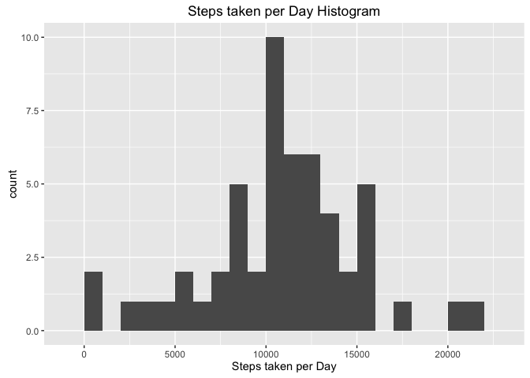
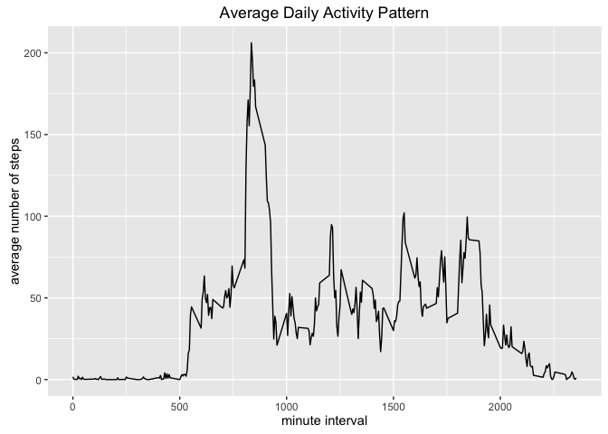
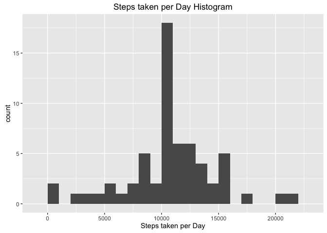
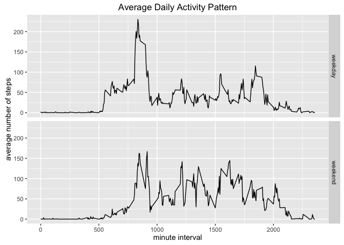

# Reproducible Research: Peer Assessment 1


## Loading and preprocessing the data


```r
library(ggplot2)
```

To load and process the data, I used the read.csv() method specifing the type of data for each column:


```r
myData <- read.csv("activity.csv", colClasses = c("integer", "Date", "integer"))
```

## What is mean total number of steps taken per day?

To calculate the total steps taken per day I use te tapply method and compute a histogram of it:


```r
StepsPerDay <- tapply(myData$steps, myData$date, sum)
qplot(StepsPerDay, binwidth = 1000, xlab = "Steps taken per Day", main = "Steps taken per Day Histogram")
```

<!-- -->

Next I calculate the mean and median of the total number of steps taken per day:


```r
meanSteps <- mean(StepsPerDay, na.rm = T)
medianSteps <- median(StepsPerDay, na.rm = T)
```

The mean is: 10766.19 
The median is: 10765


## What is the average daily activity pattern?

To calculate the average daily activity pattern I use the aggregate method to create a new dataframe with the mean steps by minute interval and plot the pattern using the ggplot system:


```r
meanStepsbyInterval <- aggregate(x=list(steps=myData$steps), by=list(interval=myData$interval),FUN=mean, na.rm=TRUE)
ggplot(meanStepsbyInterval, aes(x=interval, y=steps)) +
    geom_line() +
    ggtitle("Average Daily Activity Pattern") +
    xlab("minute interval") +
    ylab("average number of steps") 
```

<!-- -->

```r
maxStepsInterval <- meanStepsbyInterval$interval[meanStepsbyInterval$steps == max(meanStepsbyInterval$steps)]
```

The 835 minute interval has the maximun number of steps taken in average with 206.17 steps


## Imputing missing values

First I calculate the total number of NAs:


```r
totalNas <- sum(is.na(myData$steps))
```

The total number of rows with NAs values is 2304

Filling the NAs:


```r
fillNAs <- function(interval, steps){
  newValue <- NA
  if (is.na(steps))
      newValue <- as.integer(meanStepsbyInterval$steps[meanStepsbyInterval$interval == interval])
  else
    newValue <- steps
  return(newValue)
  }
myNewData <- myData
myNewData$steps <-  mapply(FUN=fillNAs, myNewData$interval, myNewData$steps)
```

Calculate histogram:


```r
NewStepsPerDay <- tapply(myNewData$steps, myNewData$date, sum)
qplot(NewStepsPerDay, binwidth = 1000, xlab = "Steps taken per Day", main = "Steps taken per Day Histogram")
```

<!-- -->

Next I calculate the mean and median of the total number of steps taken per day:


```r
NewMeanSteps <- mean(NewStepsPerDay, na.rm = T)
NewMedianSteps <- median(NewStepsPerDay, na.rm = T)
```

The mean is: 10749.77 
The median is: 10641

The values do differ from the calculated above, this is mainly because in the first calculation all the NAs where ignored, therefore, the total amount of data is less compared to the data with the filled NAs.

## Are there differences in activity patterns between weekdays and weekends?

First I create a new factor variable by using the sapply method ann the funtion weekday below:


```r
weekday <- function(day){
  if (day == "Saturday" | day == "Sunday")
    return("weekend")
  else
    return("weekday")
 }
myNewData$day <- factor(sapply(weekdays(myNewData$date), FUN=weekday))
```

Then I create a new dataframe with the mean steps by minute interval and week or weekend day and plot the pattern using the ggplot system in two panels:


```r
newMeanStepsbyInterval <- aggregate(x=list(steps=myNewData$steps), by=list(interval=myNewData$interval, day=myNewData$day),FUN=mean, na.rm=TRUE)
ggplot(newMeanStepsbyInterval, aes(x=interval, y=steps)) +
    geom_line() + facet_grid(day~.) +
    ggtitle("Average Daily Activity Pattern") +
    xlab("minute interval") +
    ylab("average number of steps") 
```

<!-- -->

In the above plot we can see that the patterns vary slightly between weekdays and weekend days.

